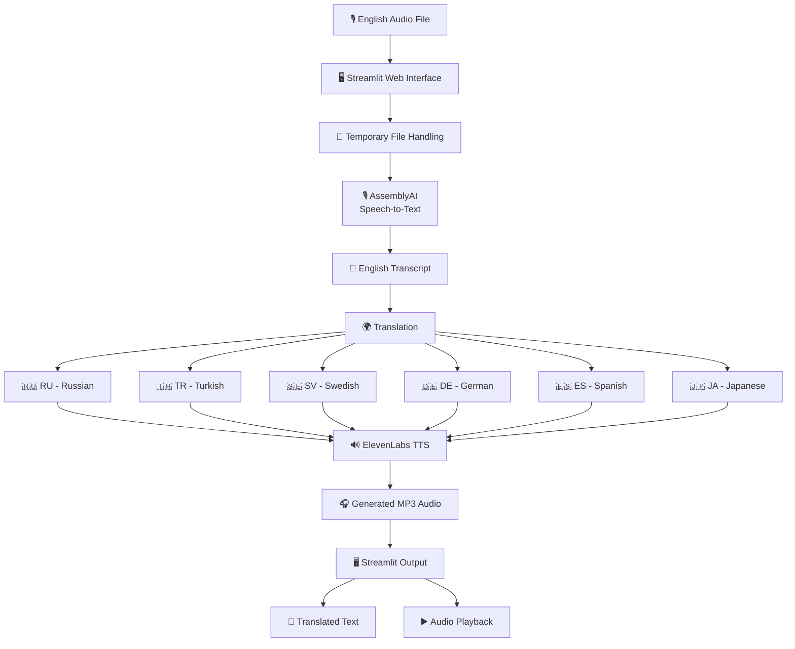
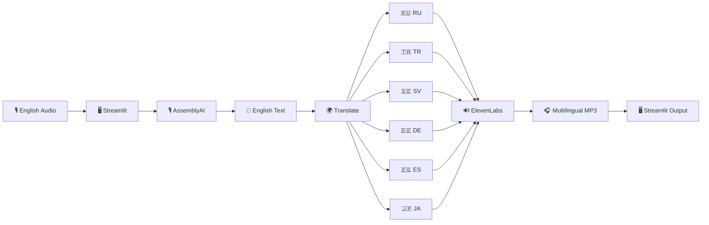

# 🎙️ AI-Based Voice Translation System

An AI-based voice translation system that converts **English speech into multiple languages** and generates **natural-sounding voice output** for each translated language.

The system takes an English audio file as input, converts the speech into text using **AssemblyAI**, translates the text into different languages, and then converts the translated text into speech using **ElevenLabs**.

The application is built using **Python** and **Streamlit**, providing a simple web interface for uploading audio, viewing the transcription and translations, and listening to the generated audio.

---

## 📌 About the Project

The main goal of this project is to make communication between people speaking different languages easier.

Instead of translating only written text, this project creates a complete **speech-to-speech translation pipeline**:

```text
English Speech
      ↓
Speech-to-Text
      ↓
English Text
      ↓
Translation
      ↓
Translated Text
      ↓
Text-to-Speech
      ↓
Translated Voice
```

For example, when a user uploads an English audio file, the system first understands the spoken English, converts it into text, translates that text into multiple languages, and finally generates audio for each translation.

The project currently supports:

- 🇷🇺 Russian
- 🇹🇷 Turkish
- 🇸🇪 Swedish
- 🇩🇪 German
- 🇪🇸 Spanish
- 🇯🇵 Japanese

---

# 🧩 What Is Needed?

The project uses several technologies and services. Each one performs a different part of the complete translation process.

| Technology / Service | Purpose |
|---|---|
| **Python** | Main programming language |
| **Streamlit** | Creates the web interface |
| **AssemblyAI** | Converts speech into text |
| **Translate** | Translates English text into target languages |
| **ElevenLabs** | Converts translated text into natural-sounding speech |
| **NumPy** | Numerical and data-related operations |
| **UUID** | Creates unique names for generated audio files |
| **Pathlib** | File and path handling |
| **OS** | Operating-system and file operations |
| **Temporary File Handling** | Temporarily stores uploaded audio during processing |

---

# 🤖 Technologies Used

## 🐍 Python

**Python** is the main programming language used to build the project.

It is responsible for:

- Connecting the different AI services
- Processing the uploaded audio
- Handling translations
- Generating audio
- Managing files
- Controlling the complete workflow
- Running the Streamlit application

---

## 🖥️ Streamlit

**Streamlit** is used to create the web interface.

It allows the user to:

- Upload an audio file
- Start the translation process
- View the English transcription
- View translated text
- Play generated audio
- Access multiple language outputs from one interface

The project therefore does not require a separate frontend framework.

The interface is created directly using Python and Streamlit.

---

## 🎙️ AssemblyAI

**AssemblyAI** is used for the **Speech-to-Text (ASR)** stage.

The uploaded English audio is sent to AssemblyAI, which produces an English transcript.

```text
English Audio
      ↓
AssemblyAI
      ↓
English Transcript
```

The transcript generated by AssemblyAI becomes the input for the translation stage.

---

## 🌍 Translate

The project uses the Python `translate` package for the translation stage.

The imported library is:

```python
from translate import Translator
```

The system takes the English transcript and translates it into the selected target languages.

Example:

```python
Translator(from_lang="en", to_lang="de")
```

This means:

```text
Source Language = English
Target Language = German
```

---

## 🔊 ElevenLabs

**ElevenLabs** is used for the **Text-to-Speech (TTS)** stage.

After the English text has been translated, the translated text is sent to ElevenLabs.

ElevenLabs then generates natural-sounding speech.

The project uses the multilingual model:

```text
eleven_multilingual_v2
```

The basic process is:

```text
Translated Text
      ↓
ElevenLabs
      ↓
Generated Voice
      ↓
MP3 Audio
```

The project also uses voice settings such as:

- Stability
- Similarity Boost
- Style
- Speaker Boost

---

# 🌐 Supported Languages

The language list follows the **actual Python implementation** of the project.

```python
languages = ["ru", "tr", "sv", "de", "es", "ja"]
```

| Code | Language | Translation |
|---|---|---|
| `en` | English | Source language |
| `ru` | Russian | English → Russian |
| `tr` | Turkish | English → Turkish |
| `sv` | Swedish | English → Swedish |
| `de` | German | English → German |
| `es` | Spanish | English → Spanish |
| `ja` | Japanese | English → Japanese |

### Language Code Examples

```text
EN → RU
English → Russian

EN → TR
English → Turkish

EN → SV
English → Swedish

EN → DE
English → German

EN → ES
English → Spanish

EN → JA
English → Japanese
```

> **Note:** `tr` represents **Turkish** in the current implementation. The README follows the code as the source of truth for the supported languages.

---

# 🔄 How the System Works

The complete system works in several stages.

### 1. User Uploads Audio

The user uploads an English audio file through the Streamlit web interface.

Supported formats include:

```text
.wav
.mp3
.m4a
```

---

### 2. Temporary Audio Processing

The uploaded audio is temporarily stored so that it can be processed by the speech-recognition system.

Temporary file handling is used instead of requiring permanent storage of the original uploaded file.

---

### 3. Speech-to-Text

The audio is sent to **AssemblyAI**.

```text
Audio File
    ↓
AssemblyAI
    ↓
English Transcript
```

The returned transcript contains the recognized English speech.

---

### 4. Translation

The English transcript is passed to the translation stage.

The application loops through the target languages:

```text
English
   ↓
┌─────────┬─────────┬─────────┐
↓         ↓         ↓
Russian  Turkish  Swedish
↓         ↓         ↓
German   Spanish  Japanese
```

Each language receives its own translated text.

---

### 5. Text-to-Speech

Each translated sentence is passed to **ElevenLabs**.

```text
Russian Text
      ↓
ElevenLabs
      ↓
Russian Audio

Turkish Text
      ↓
ElevenLabs
      ↓
Turkish Audio

...and so on
```

The generated speech is saved as an MP3 file.

---

### 6. Output

The Streamlit interface displays the result for every language.

Each output contains:

- Language name
- Translated text
- Audio player

The user can listen to the generated voice for each language.

---

# 📊 Complete System Flowchart

The complete workflow can be represented as:



---

# 🏗️ Technical Architecture

The project follows a simple three-stage AI architecture:

```text
┌──────────────────────┐
│   Speech Recognition │
│      AssemblyAI      │
└──────────┬───────────┘
           │
           ▼
┌──────────────────────┐
│     Translation      │
│      Translate       │
└──────────┬───────────┘
           │
           ▼
┌──────────────────────┐
│   Speech Generation  │
│      ElevenLabs      │
└──────────────────────┘
```

In short:

```text
ASR → Translation → TTS
```

Where:

- **ASR** = Automatic Speech Recognition
- **Translation** = English text to target-language text
- **TTS** = Text-to-Speech

---

# 🧠 How the Code Works

## 1. Importing Libraries

The project imports the required Python libraries and APIs.

```python
import os
import numpy as np
import streamlit as st
import assemblyai as aai
from translate import Translator
import uuid
from elevenlabs import VoiceSettings
from elevenlabs.client import ElevenLabs
from pathlib import Path
```

These libraries are used for:

- User interface
- Speech recognition
- Translation
- Text-to-speech
- File handling
- Unique file names

---

## 2. Uploading an Audio File

The Streamlit application provides an upload option for audio files.

The supported formats are:

```text
WAV
MP3
M4A
```

The uploaded file becomes the input for the translation pipeline.

---

## 3. Transcribing the Audio

The audio is processed using AssemblyAI.

The basic flow is:

```text
Uploaded Audio
      ↓
AssemblyAI
      ↓
Transcript
```

The transcript is then passed to the translation function.

---

## 4. Translating the Transcript

The translation process uses the target-language codes:

```python
languages = ["ru", "tr", "sv", "de", "es", "ja"]
```

For each language, the application creates a translator.

For example:

```python
translator = Translator(
    from_lang="en",
    to_lang="de"
)
```

The same process is repeated for the other target languages.

---

## 5. Generating Voice

The translated text is sent to ElevenLabs.

The multilingual model used is:

```text
eleven_multilingual_v2
```

The generated audio is saved as an MP3 file.

A UUID is used to create a unique filename:

```python
save_file_path = f"{uuid.uuid4()}.mp3"
```

This helps prevent generated audio files from accidentally using the same filename.

---

## 6. Displaying the Output

The Streamlit application displays the translated results.

The outputs are arranged into language sections.

```text
┌─────────────┬─────────────┬─────────────┐
│   Russian   │   Turkish   │   Swedish   │
│             │             │             │
│ Translated  │ Translated  │ Translated  │
│    Text     │    Text     │    Text     │
│             │             │             │
│    Audio    │    Audio    │    Audio    │
└─────────────┴─────────────┴─────────────┘

┌─────────────┬─────────────┬─────────────┐
│   German    │   Spanish   │   Japanese  │
│             │             │             │
│ Translated  │ Translated  │ Translated  │
│    Text     │    Text     │    Text     │
│             │             │             │
│    Audio    │    Audio    │    Audio    │
└─────────────┴─────────────┴─────────────┘
```

---

# 🧩 Main Functions

The application is organized around the main processing functions.

## `voice_to_voice()`

This function controls the complete translation pipeline.

```text
Audio
  ↓
Transcription
  ↓
Translation
  ↓
Speech Generation
  ↓
Output
```

---

## `transcribe_audio()`

This function handles speech recognition.

```text
Audio
  ↓
AssemblyAI
  ↓
English Transcript
```

---

## `translate_text()`

This function handles multilingual translation.

```text
English Text
      ↓
Translation
      ↓
RU / TR / SV / DE / ES / JA
```

---

## `text_to_speech()`

This function generates speech using ElevenLabs.

```text
Translated Text
      ↓
ElevenLabs
      ↓
Generated MP3
```

---

# 📥 Input

The system accepts English audio files in the following formats:

| Format | Supported |
|---|---|
| `.wav` | ✅ |
| `.mp3` | ✅ |
| `.m4a` | ✅ |

The intended input is spoken English audio.

---

# 📤 Output

The application generates translated text and voice output for:

| Language | Code | Output |
|---|---|---|
| Russian | `ru` | Text + Audio |
| Turkish | `tr` | Text + Audio |
| Swedish | `sv` | Text + Audio |
| German | `de` | Text + Audio |
| Spanish | `es` | Text + Audio |
| Japanese | `ja` | Text + Audio |

The generated voice output is provided as MP3 audio.

---

# 🧪 Example

Suppose the uploaded English audio contains:

> **"Good morning, everyone. My name is Shashi Mohan."**

### Step 1 — Speech-to-Text

AssemblyAI converts the audio into:

```text
Good morning, everyone. My name is Shashi Mohan.
```

### Step 2 — Translation

The English text is translated into the supported languages.

```text
RU → Russian
TR → Turkish
SV → Swedish
DE → German
ES → Spanish
JA → Japanese
```

### Step 3 — Text-to-Speech

Each translated text is sent to ElevenLabs.

```text
Russian Text
     ↓
Russian Voice

Turkish Text
     ↓
Turkish Voice

Swedish Text
     ↓
Swedish Voice

German Text
     ↓
German Voice

Spanish Text
     ↓
Spanish Voice

Japanese Text
     ↓
Japanese Voice
```

---

# 📁 Project Structure

A simple repository structure for the project is:

```text
AI-Based-Voice-Translation-System/
│
├── voice_translator.py
├── requirements.txt
├── .gitignore
├── README.md
└── generated_audio/
```

Generated audio files should normally not be permanently committed to the repository if they are only temporary application outputs.

---

# ⚙️ Installation

## 1. Clone the Repository

```bash
git clone <your-repository-url>
```

Move into the project directory:

```bash
cd AI-Based-Voice-Translation-System
```

---

## 2. Create a Virtual Environment

```bash
python -m venv venv
```

### Windows

```bash
venv\Scripts\activate
```

### macOS / Linux

```bash
source venv/bin/activate
```

---

## 3. Install Required Packages

Create a `requirements.txt` file containing the required packages.

Example:

```text
streamlit
numpy
assemblyai
translate
elevenlabs
```

Then install them:

```bash
pip install -r requirements.txt
```

---

# 🔐 API Keys

This project requires API keys for the external AI services.

The application uses API access for:

- AssemblyAI
- ElevenLabs

**Never publish API keys directly in your GitHub repository.**

Use environment variables or Streamlit secrets instead.

Example:

```python
import os

ASSEMBLYAI_API_KEY = os.getenv("ASSEMBLYAI_API_KEY")
ELEVENLABS_API_KEY = os.getenv("ELEVENLABS_API_KEY")
```

If API keys have previously been placed directly in the source code, they should be **revoked/rotated before publishing the repository**.

---

# ▶️ Running the Application

After installing the dependencies, run the Streamlit application:

```bash
streamlit run voice_translator.py
```

The Streamlit application will open in your browser.

Then:

1. Upload an English audio file.
2. Start the processing.
3. Wait for transcription and translation.
4. View the translated text.
5. Play the generated audio for each language.

---

# 📊 Technology Stack

| Category | Technology |
|---|---|
| Programming Language | Python |
| Web Framework | Streamlit |
| Speech-to-Text | AssemblyAI |
| Translation | Translate |
| Text-to-Speech | ElevenLabs |
| TTS Model | `eleven_multilingual_v2` |
| Audio Output | MP3 |
| Supported Input | WAV, MP3, M4A |

---

# 🔬 Project Workflow in One View



---

# 📈 Results

The project demonstrates that speech recognition, multilingual translation, and text-to-speech can be combined into one application.

The system provides:

- English speech transcription
- Multilingual text translation
- Natural-sounding voice generation
- Multiple language outputs
- A simple web interface
- Audio playback through the browser

The project evaluation also examines transcription accuracy, translation quality, TTS naturalness, processing time, and user experience.

---

# ⚠️ Limitations

The current system has some limitations:

- Translation quality can vary depending on the sentence and context.
- Long or complex phrases may produce less accurate translations.
- Processing depends on external APIs and an internet connection.
- The current system works with uploaded audio rather than continuous live speech.
- Only a limited number of languages are currently supported.
- Offline/on-device processing is not implemented.

---

# 🚀 Future Scope

The project can be improved in several ways:

- 🌍 Add more regional and low-resource languages
- 🎙️ Add real-time audio recording
- ⚡ Support live voice translation
- 📴 Implement offline/on-device AI models
- 🧠 Improve context-aware translation
- 📱 Develop a mobile version
- 🎯 Improve translation of complex and idiomatic speech

---

# 📚 References

The project uses and refers to resources related to:

- **AssemblyAI** — Speech-to-Text API
- **ElevenLabs** — Text-to-Speech API
- **Google Translate / Translation Services**
- **Streamlit** — Python web application framework
- **Speech and Language Processing** — Daniel Jurafsky and James H. Martin

---

# 👨‍💻 Project Information

**Project Name:** AI-Based Voice Translation System

**Developer:** Shashi Mohan

**Course:** B.Tech — Computer Science & Engineering

**University:** University of Engineering & Management, Jaipur

**Supervisor:** Prof. Soumen Sarkar

---

# ⭐ Conclusion

The AI-Based Voice Translation System demonstrates a complete **speech-to-speech translation workflow** using modern AI services.

The system takes:

```text
🎙️ English Speech
```

and processes it through:

```text
AssemblyAI
    ↓
Speech-to-Text
    ↓
Translation
    ↓
ElevenLabs
    ↓
Text-to-Speech
```

to produce:

```text
🔊 Russian Audio
🔊 Turkish Audio
🔊 Swedish Audio
🔊 German Audio
🔊 Spanish Audio
🔊 Japanese Audio
```

By combining **Python, Streamlit, AssemblyAI, translation services, and ElevenLabs**, the project provides a simple way to convert spoken English into multilingual text and voice output.

---

## 📌 Quick Summary

```text
INPUT
🎙️ English Audio
       ↓
       ↓
ASSEMBLYAI
🎙️ Speech-to-Text
       ↓
       ↓
TRANSLATION
🌍 English → RU / TR / SV / DE / ES / JA
       ↓
       ↓
ELEVENLABS
🔊 Text-to-Speech
       ↓
       ↓
OUTPUT
🎧 Multilingual Audio + Translated Text
```

**Built with Python ❤️ and AI technology.**
